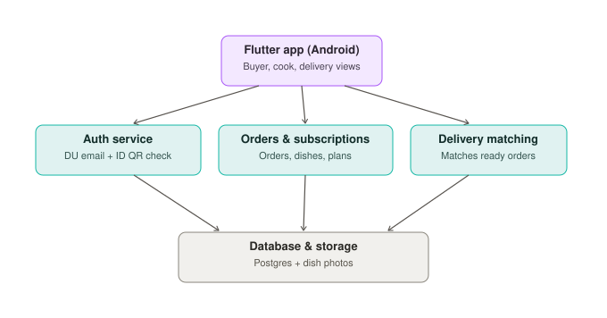

# System Architecture

> **Status:** planned design. None of the backend services below are built
> yet — the current app runs entirely on mock data (`lib/data/mock_data.dart`).
> This document describes the target architecture the app is being designed
> toward.

## Diagram

## Layers

### 1. Client — Flutter app (Android)

A single Flutter codebase serving all three user roles (buyer, cook,
delivery partner) through role-based views within one app, toggled from the
Profile screen rather than shipped as separate apps. This keeps the build
simple and matches the project's low-manpower constraint.

### 2. Backend services

Three logical services, which can start as modules within a single backend
and be split out later if load requires it — there's no need to build them
as separate deployments from day one:

| Service | Responsibility |
|---|---|
| **Auth service** | Verifies `@du.ac.bd` email domain and the student ID card QR scan at registration. Issues session tokens for the app to use on subsequent requests. |
| **Orders & subscriptions service** | Owns dishes, subscription plans, and orders. Handles the buyer-facing browse/order/subscribe flow and the cook-facing dashboard. |
| **Delivery matching service** | Matches ready orders to available delivery partners by area/time slot. Starts as manual claiming (partners see a list and pick an order) before any automatic assignment logic is built. |

### 3. Data layer — Database & storage

A single Postgres database (schema: [DATABASE_SCHEMA.md](DATABASE_SCHEMA.md))
plus object storage for dish photos and profile images. No need to split
these early — co-locating them is simplest until there's a concrete reason
to separate.

## What's deliberately left out of v1

- **No payment gateway** — cash on delivery only, so there's no PCI/payment
  integration to build or secure yet.
- **No push notification service** — order status is polled/refreshed in-app
  for now; can be added once there's a reason to (e.g. real-world order
  volume where users need out-of-app alerts).
- **No separate admin dashboard service** — moderation (flag review) is
  expected to be handled through direct database access or a minimal
  internal tool until volume justifies building one.

## Why this shape

The architecture is intentionally boring and centralized: one client, a
small number of backend services, one database. This matches the project's
constraints (low cost, low manpower, no dedicated infra team) and avoids
premature microservice complexity for an app that doesn't have production
traffic yet. Split services out only when a concrete scaling or ownership
problem shows up — not in advance of one.
