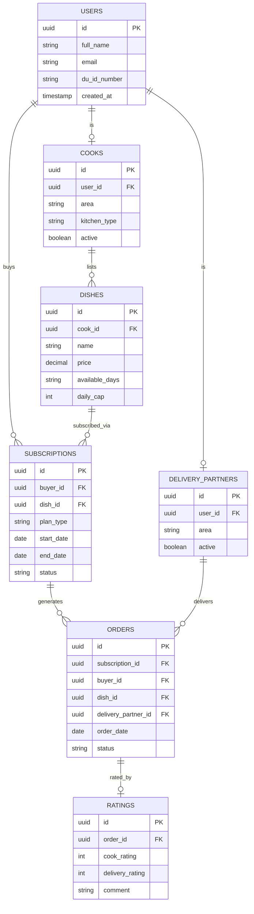

# Database Schema

> **Status:** planned design. Not yet implemented — the current app runs on
> mock data (`lib/data/mock_data.dart`). The Dart models in
> `lib/models/models.dart` are a simplified mirror of this schema.

## Entity-relationship diagram

*(GitHub renders Mermaid diagrams natively in Markdown — this should display
as a diagram directly on the repo page.)*

## Tables

### `users`
The base identity table for every person on the platform, regardless of
role. A user becomes a cook and/or delivery partner by having a
corresponding row in those tables — one person can hold multiple roles.

| Column | Type | Notes |
|---|---|---|
| `id` | uuid, PK | |
| `full_name` | string | |
| `email` | string | Must end in `@du.ac.bd` — enforced at the application layer during verification |
| `du_id_number` | string | Extracted from the ID card QR scan at registration |
| `created_at` | timestamp | |

### `cooks`
| Column | Type | Notes |
|---|---|---|
| `id` | uuid, PK | |
| `user_id` | uuid, FK → `users.id` | |
| `area` | string | Hall/hostel area, used for hyperlocal browsing |
| `kitchen_type` | string | Self-declared: shared mess kitchen, home kitchen, hall kitchen |
| `active` | boolean | Whether currently accepting orders |

### `dishes`
| Column | Type | Notes |
|---|---|---|
| `id` | uuid, PK | |
| `cook_id` | uuid, FK → `cooks.id` | |
| `name` | string | |
| `price` | decimal | Base one-time price; weekly/monthly pricing can be derived or stored separately depending on final pricing model |
| `available_days` | string | e.g. "Mon,Tue,Wed,Thu,Fri" |
| `daily_cap` | int | Max orders per day for this dish |

### `delivery_partners`
| Column | Type | Notes |
|---|---|---|
| `id` | uuid, PK | |
| `user_id` | uuid, FK → `users.id` | |
| `area` | string | Coverage area |
| `active` | boolean | Whether currently available for deliveries |

### `subscriptions`
| Column | Type | Notes |
|---|---|---|
| `id` | uuid, PK | |
| `buyer_id` | uuid, FK → `users.id` | |
| `dish_id` | uuid, FK → `dishes.id` | |
| `plan_type` | string | `one_time`, `weekly`, or `monthly` |
| `start_date` | date | |
| `end_date` | date | Null/open-ended for ongoing subscriptions |
| `status` | string | `active`, `paused`, `cancelled` |

### `orders`
A single day's delivery instance, generated from a subscription (or created
directly for a one-time order).

| Column | Type | Notes |
|---|---|---|
| `id` | uuid, PK | |
| `subscription_id` | uuid, FK → `subscriptions.id` | Nullable for one-time orders not tied to a plan |
| `buyer_id` | uuid, FK → `users.id` | |
| `dish_id` | uuid, FK → `dishes.id` | |
| `delivery_partner_id` | uuid, FK → `delivery_partners.id` | Nullable until matched |
| `order_date` | date | |
| `status` | string | `placed`, `cooking`, `picked_up`, `delivered` |

### `ratings`
| Column | Type | Notes |
|---|---|---|
| `id` | uuid, PK | |
| `order_id` | uuid, FK → `orders.id` | |
| `cook_rating` | int | 1–5 |
| `delivery_rating` | int | 1–5 |
| `comment` | string | Optional free text |

## Design notes

- **One `users` table, role tables layered on top** rather than a `role`
  column on `users`, because a person can be a buyer and a cook and a
  delivery partner simultaneously — a single enum column can't represent
  that cleanly.
- **`orders` is separate from `subscriptions`** because a subscription is a
  standing plan, while an order is one day's actual delivery instance —
  this is what lets a buyer pause a single day without cancelling the whole
  plan.
- Pricing per plan type (one-time vs. weekly vs. monthly) is simplified here
  to one `price` column on `dishes`; the actual pricing model (flat rate vs.
  per-plan discount) is an open product decision, not just a schema one —
  see [DESIGN.md](DESIGN.md).
